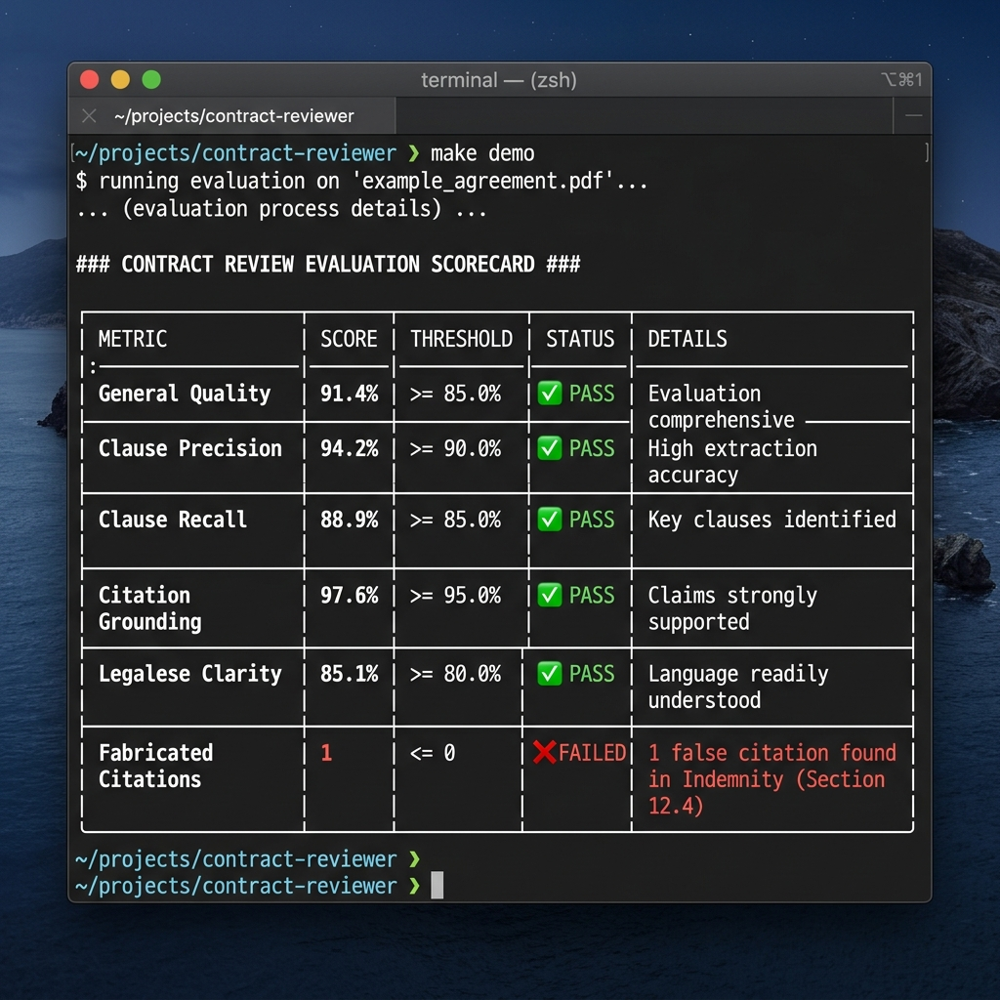
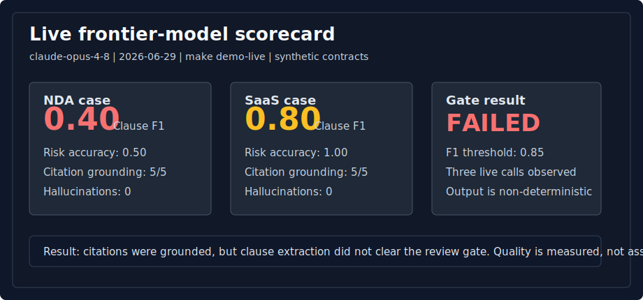

# contract-review-eval-harness

[](https://github.com/sebastianfoerste/contract-review-eval-harness/actions/workflows/ci.yml)

See [CASE_STUDY.md](CASE_STUDY.md) for the problem, controls, and limitations.

Evaluation harness for legal AI contract review: clause scoring, citation grounding, hallucination counts, against a gold answer set. Not legal advice; data is synthetic.

**Public-safety posture:** synthetic contracts only, visible source provenance in every citation check, an explicit human review gate before reliance, and no legal advice.

> **If you don't code:** scroll to [What the demo produces](#what-the-demo-produces). This repo ships a sample output you can read in the browser. The point isn't the code; it's whether the legal work is structured, cited, reviewable, and testable.



## Run it

```bash
git clone https://github.com/sebastianfoerste/contract-review-eval-harness
cd contract-review-eval-harness
make install && make test
make demo
```

Runs end to end, offline and deterministically.

## What the demo produces

The demo writes a scorecard with clause-level scoring, citation-grounding assessment, and hallucination detection. In the sample run, the harness catches a fabricated citation and marks the output for rejection. You can read the committed sample output: [`examples/scorecard.md`](examples/scorecard.md) and [`examples/scorecard.json`](examples/scorecard.json).

```markdown
# Contract Review Eval Scorecard: nda

## Scores

| Dimension | Score | Notes |
|---|---:|---|
| Clause precision | 0.83 | predicted clause types that were expected |
| Clause recall | 1.00 | expected clause types that were found |
| Clause F1 | 0.91 | harmonic mean of precision and recall |
| Risk-flag accuracy | 0.50 | risky clauses flagged at the expected severity |
| Citation grounding | 0.80 | 4/5 quotes grounded in the source (exact match or 85%+ token overlap) |
| Hallucination count | 1 | cited quotes not grounded in the source |

## Failure modes checked

- Over-extraction: clause precision below 1.00.
- Missed clause: clause recall below 1.00.
- Wrong severity: risk-flag accuracy below 1.00.
- Fabricated citation: hallucination count above 0.
```

In the sample run, the harness catches a fabricated citation and marks the output for rejection.

## What it checks / does

| Check / Metric | Focus | Verification Method |
|---|---|---|
| Clause Precision / Recall | Extraction accuracy | Compares predicted clause types to a gold standard set |
| Risk-Flag Accuracy | Severity grading | Checks if predicted risk severities match expected values |
| Citation Grounding | Hallucination tracking | Validates quoted text segments by exact match or 85%+ token overlap against the source document |

---

> **What workflow does this improve?** First-pass contract review (clause extraction, risk flags, citations).
> **Who is the user?** A Legal Engineer or counsel deciding whether AI review output is trustworthy enough to rely on.
> **Where does human review happen?** Always. The scorecard tells a lawyer where to look; it never replaces sign-off.
> **What is blocked until approval?** Reliance. A non-zero hallucination count means a citation must be rejected before use.
> **What would I tell Product?** Which failure mode dominates: over-extraction, wrong severity, or fabricated citations, so Engineering knows what to fix first.

## Problem

"The AI reviews contracts" is a demo, not a claim you can take to a top firm. The question
that earns trust is: *how do you know the review is any good?* This harness answers that.
It scores AI review output against an expected answer set and counts the failures that
matter most in legal work: a flagged risk at the wrong severity, a citation that is not
actually in the document.

## What this proves

- I measure quality, I do not assert it: every dimension is a number against a gold set.
- I treat hallucination as a first-class metric, not an afterthought: a fabricated citation is counted and called out.
- I keep a human-review gate explicit: the scorecard ends with what a lawyer must confirm.
- I build for reproducibility: the default path is offline and deterministic, so a reviewer runs the demo with no API key.

## Demo path

```bash
make install            # uv sync
make test               # the scorer is unit-tested
make demo               # writes scorecard.md for the NDA case
uv run python -m contract_eval evaluate --case saas   # the SaaS case
```

## Live run against a real frontier model (optional)

The default path is a deterministic stub so a reviewer needs no key. To score an
actual model's output instead, install the optional adapter and point it at Anthropic:

```bash
uv sync --extra live          # pulls the Anthropic SDK; the default path never needs it
export ANTHROPIC_API_KEY=...   # your own key
make demo-live                 # runs the live adapter on the NDA and SaaS cases
```

`make demo-live` sends each synthetic contract to the model, parses the structured
review it returns, and scores that real output against the same gold answer set: clause
P/R/F1, risk-flag accuracy, citation grounding, hallucination count. The point is that the
harness grades a *real* model the same way it grades the stub: nothing is asserted, every
number is checked against a known answer, including whether a frontier model invents a
citation that is not in the contract.

A captured run against `claude-opus-4-8` is committed here: [`examples/live-run-claude-opus-4-8-2026-06-29.md`](examples/live-run-claude-opus-4-8-2026-06-29.md).



Live output is non-deterministic; the committed file is a dated snapshot, not a stable
benchmark.

## Sample scorecard (NDA)

The NDA stub is deliberately imperfect: it extracts a clause that is not in the
contract, flags one clause at the wrong severity, and cites one quote that is not in the
source. The harness catches all three (see the scorecard above). A perfect-looking model
would score 1.00 across the board; the point is that this one does not, and you can see
exactly why.

## Use cases

- **NDA** (`--case nda`): confidentiality, definition, term, return/destruction, governing law.
- **SaaS agreement** (`--case saas`): service levels, data protection, limitation of liability, term, auto-renewal.

Both generalize beyond any single regulatory regime, which is why they sit ahead of
domain-specific contracts here.

## How a Legal Engineer would use this in a customer meeting

A firm asks whether they can trust the tool on their NDAs. You do not argue. You run the
harness on a representative NDA and put the scorecard on screen. The conversation moves
from "is AI safe" to "here is the citation-grounding rate, here is the one hallucination we
caught, and here is the human-review step that gates reliance." That is a procurement
conversation a general counsel can sign off on.

## How it works

```
contract (data/<case>_sample.md)
        │
        ▼
   adapter  ──  StubAdapter (fixture, default)  or  LiveAdapter (--live, Anthropic)
        │
        ▼
  ReviewOutput  ── scored against expected/<case>.json
        │
        ▼
   scorer  ──  clause P/R/F1 · risk-flag accuracy · citation grounding · hallucination count
        │
        ▼
  scorecard.md
```

`--live` is strictly optional. The Anthropic SDK is imported lazily; the default offline
path never needs it or an API key.

## Synthetic data statement

Every contract under `data/` is synthetic and fabricated for evaluation. No real agreement,
client, or personal data. See [`data/README.md`](data/README.md).

## Limitations

A public-safe prototype, not a production benchmark or a leaderboard; it measures the
review *method*, not a public score.

- The answer sets are synthetic and intentionally small.
- It covers two contract types today (NDA and SaaS); broader coverage comes from
  expanding `expected/` and running `--live`.
- Clause matching is by type. Citation grounding uses exact matches plus a simple
  85% token-overlap fallback. It is transparent and intentionally shallow; it does not
  assess legal-semantic equivalence.
- It does not yet compare multiple model families or model human-reviewer disagreement.
- It excludes privilege, confidentiality, and customer-data workflows.

Next production step: larger, reviewer-calibrated answer sets, versioned benchmark
runs, and model comparison across contract types.

## Stack

Python 3.12+, Pydantic v2, pytest, managed with `uv`. Optional live adapter uses the
Anthropic SDK behind a flag.

## Human-authored legal judgment
AI tools assisted the implementation, but the parts that carry the value are
human-authored: the gold answer sets, the risk taxonomy, the clause types, and the
citation-grounding rules. The point of this repository is not code volume; it is showing
how legal judgment can be made structured, testable, and reviewable.

## Why lawyers should care
The harness makes review quality visible. It doesn't ask whether the answer sounds
plausible; it checks whether it matches a known answer set, cites the right text, and
avoids unsupported claims.

## Why product teams should care
It turns subjective review quality into measurable failure modes: missed issues,
wrong severity, ungrounded citations, hallucinated text, so it can drive regression
testing, model comparison, product QA, and reviewer-escalation logic.
