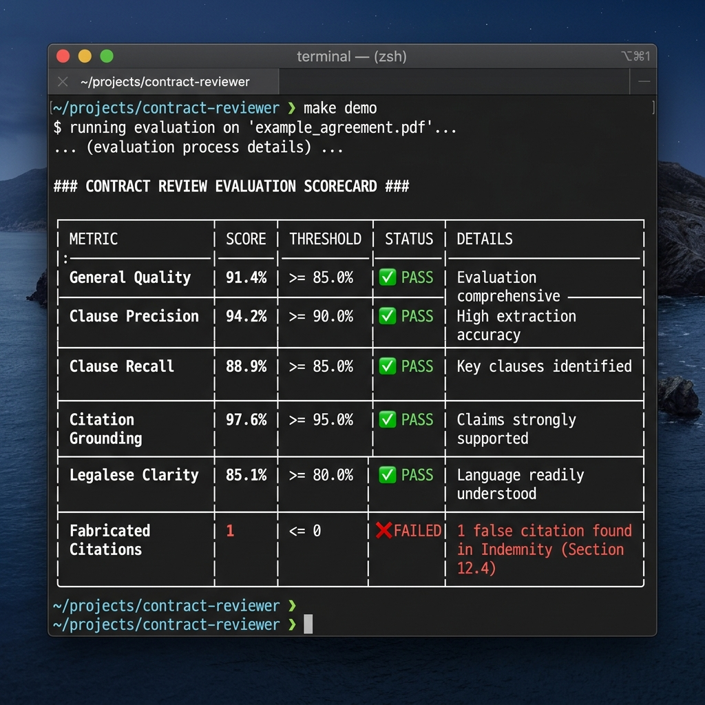

# contract-review-eval-harness

[](https://github.com/sebastianfoerste/contract-review-eval-harness/actions/workflows/ci.yml)

See [CASE_STUDY.md](CASE_STUDY.md) for the problem, controls, and limitations.

Evaluation harness for legal AI contract review: clause scoring, citation grounding and hallucination counts against a gold answer set. Not legal advice; data is synthetic.

**Public-safety posture:** synthetic contracts only, visible source provenance in every citation check, an explicit human review gate before reliance, and no legal advice.
Verification manifest: [`docs/verification-manifest.json`](docs/verification-manifest.json).



## Run it

```bash
git clone https://github.com/sebastianfoerste/contract-review-eval-harness
cd contract-review-eval-harness
make install && make test
make demo
```

Runs end to end, offline and deterministically.

## What the demo produces

The demo writes a scorecard with clause-level scoring, citation-grounding assessment and unsupported-citation detection. In the sample run, the harness catches a fabricated citation and marks the output for rejection. You can read the committed sample output in [`examples/scorecard.md`](examples/scorecard.md) and [`examples/scorecard.json`](examples/scorecard.json).

The [release certificate](examples/release-certificate.md) evaluates all bundled
cases under a stricter legal-review policy. It hashes the source contract, gold
answer, and adapter output for each case, rejects any unsupported citation, and
binds the suite decision to a reproducible integrity digest. `make
certificate-verify` re-runs the offline adapter, recomputes every score and input
digest, and fails on certificate tampering or benchmark drift.

The [Adversarial Contract Robustness Lab](examples/adversarial-robustness-report.md)
adds eighteen deterministic minimal-pair scenarios across the NDA, SaaS and DPA
fixtures: party-definition changes, residual-knowledge carve-outs, duration changes,
conflicting governing law, instruction injection, uptime negation, model-training
rights, liability-cap changes, renewal windows, missing schedules, processing-instruction
carve-outs, discretionary confidentiality, extended breach windows, and one
semantic-preserving control per contract type. The
[local HTML campaign view](examples/adversarial-robustness-report.html) exposes
critical recall, severity-weighted sensitivity, false reassurance, required
abstention, citation grounding, injection resilience, repeated-run consistency,
and every scenario-level failure.

The campaign design follows current evidence that apparently strong aggregate
scores can conceal subtle legal failures. [ContractEval](https://arxiv.org/abs/2508.03080)
reports material differences across contract-review tasks and model settings.
[Better Call CLAUSE](https://arxiv.org/abs/2511.00340) stress-tests nuanced and
adversarial contract flaws. [LegalCiteBench](https://arxiv.org/abs/2605.10186)
documents persistent weaknesses in exact legal citation tasks. The committed
offline report therefore preserves the adapter's failures and carries forward the
baseline release-certificate rejection.

```markdown
# Contract Review Eval Scorecard: nda

| Dimension | Score | Notes |
|---|---:|---|
| Clause precision | 0.92 | predicted clause types that were expected |
| Clause recall | 1.00 | expected clause types that were found |
| Clause F1 | 0.96 | harmonic mean of precision and recall |
| Risk-flag accuracy | 0.50 | risky clauses flagged at the expected severity |
| Citation grounding | 0.89 | 8/9 quotes grounded in the source |
| Hallucination count | 1 | cited quotes not grounded in the source |
```

## What it checks

- Clause precision and recall.
- Clause coverage by source span, independent of the review's own vocabulary.
- Risk identification precision, recall and F1, so over-flagging is penalised.
- Severity accuracy on identified risks, with a severity confusion count.
- Duplicate and self-contradicting risk flags.
- Citation grounding as an exact span of the normalised source.
- Unsupported or fabricated citations.
- Input drift and suite-level release eligibility.
- Adversarial and subtle contract changes.
- Critical false reassurance and required abstention.
- Instruction-injection and semantic-invariance behavior.
- Repeated-run consistency and input-bound robustness verification.

## Two separate gates

`make test` runs `demo-regression-policy.v2`, a threshold gate against the deliberately
imperfect bundled fixture. It detects regression. Passing it means nothing changed
unexpectedly; it does not mean an output is fit for use.

The [release certificate](examples/release-certificate.md) is the eligibility decision,
under `strict-legal-release-policy.v2`. Nine requirements live in one typed registry that
drives the decision, the policy the certificate publishes, the scores each case reports,
and what the verifier expects. A case reaches `PILOT_ELIGIBLE` only when all nine pass.
An unsupported citation or grounding below 100 percent is a hard `REJECT`; every other
shortfall is `HUMAN_REVIEW_REQUIRED`.

Certificate schema v3 publishes every one of those nine decision inputs. Earlier
certificates advertised a `risk_flag_accuracy_target` that no longer decided anything and
omitted the risk metrics that did, so a reader could not reconstruct the decision from the
artifact. Diagnostics, including legacy risk-flag accuracy and span coverage, are printed
in a separate table and never affect eligibility.

A green CI run is not an approved benchmark result. Every verification result publishes a
`verification_scope`: v1 certificates verify for integrity only, v2 certificates reproduce
under their frozen builder while their inputs still match and degrade to integrity only
once an input moves, and v3 certificates reproduce in full. An unknown schema fails closed
naming the value it saw.

## Problem

"The AI reviews contracts" is a demo, not a claim a serious reviewer can rely on. The useful question is: how do you know the review is any good? This harness scores AI review output against an expected answer set and counts the failures that matter most in legal work.

## Verified behavior

- Quality is measured, not asserted.
- Unsupported citations are treated as first-class failures.
- The scorecard ends with human-review instructions.
- The default path is offline and deterministic, so the demo runs with no API key.

## Demo path

```bash
make install
make test
make demo
uv run python -m contract_eval evaluate --case saas
make certificate
make certificate-verify
make robustness
make robustness-check
```

## Optional live-model run

The default path is a deterministic stub. The optional live adapter can score output from a frontier model against the same gold answer set:

```bash
uv sync --extra live
export ANTHROPIC_API_KEY=...
uv run python -m contract_eval robustness --live --runs 3 --out live-results
```

The model is selectable, so the same gold set can be replayed across versions and
compared. Pass `--model`, or set `CONTRACT_EVAL_MODEL`; the default is
`claude-opus-5`.

```bash
uv run python -m contract_eval evaluate --case all --live --model claude-opus-5
```

A captured run against a frontier model is committed in the examples folder as a dated snapshot. Live output is non-deterministic; the committed file is not a stable benchmark. Any published comparison must name the model, the date and the harness version, because a score without those three is not reproducible.

Every adapter attempt is now captured before it is parsed. A capture embeds the source
and gold snapshots, the sanitized request, the raw response and the parsed output, each
hashed, and is written atomically before the provider is called. Truncated, malformed,
interrupted and provider-error attempts leave evidence and are never scored.

```bash
uv run python -m contract_eval verify-capture --input captures/<run>/<capture>.json
uv run python -m contract_eval score-output --input <capture>.json --aliases both
```

`score-output` re-scores captured bytes offline through the same `score_review` a live
run uses, so a replayed number proves something about the published one. Current-input
drift fails by default; `--allow-input-drift` reproduces the historical result and marks
it comparison-only and ineligible for certification.

The [2026-09-01 run](examples/live-run-claude-opus-5-2026-09-01.md) is worth reading for
what it found in the harness rather than in the model. One captured adapter output was
scored twice, with clause aliasing off and on. Identical bytes scored 0.522 and 0.783
clause F1 on the NDA, because clause-type labels were being compared by string equality.
Aliasing raises every score but does not solve it: recall reaches at most 0.818, the map
does not transfer between runs, and it cannot express a gold clause the model split in
two.

`span_coverage` measures the same output without reference to labels. Every gold clause
carries a verbatim anchor locating it in the source, each clause owns the region up to
the next anchor, and a clause counts as covered when a grounded citation lands inside
it. On that measure the same output scores 1.000, 1.000 and 0.900 against label-based
F1 of 0.783, 0.818 and 0.476. It measures citation placement, not comprehension.

That report is generated from the captures by `make live-run-report`, and CI fails on any
drift between the committed file and a fresh generation. It is no longer transcribed by
hand, which is how the retracted 2026-08-28 table came to present two separate
generations as one output scored twice. That record is retained with its comparison
withdrawn.

## Use cases

Thirty-two clause types across three agreements:

- **NDA** — definition, confidentiality, term, return/destruction, governing law, permitted
  disclosure, residual knowledge, no licence, injunctive relief, assignment, notices.
- **SaaS agreement** — service levels, data protection, limitation of liability, term,
  auto-renewal, sub-processors, security, IP and model training, indemnity, fees, data
  export on termination.
- **Data processing agreement** — Art. 28(3) lit. a to h GDPR, Chapter V transfers,
  governing law.

Each gold set records a `severity_rationale` naming why every flag carries its severity,
so the calibration can be challenged rather than assumed, and a `clause_aliases` map
declaring synonyms for the same clause so that vocabulary is not scored as legal error.
Both fields are typed and validated: unknown keys are rejected, and every risk flag must
carry exactly one rationale. Alias validation is structural only and cannot establish
that an alias is a genuine synonym, which is why they are manually reviewed. Some clauses in each agreement
are deliberately unremarkable: a reviewer who flags them is producing false positives.

Every case is built so that clause coverage and legal judgment come apart. The offline
adapter reaches 0.95 to 0.96 clause F1 on all three — it finds every expected clause —
against 0.50 to 0.60 risk-flag accuracy. On the DPA it rates the exclusion of on-site inspections and a transfer clause
carrying no Chapter V mechanism as low risk; on the SaaS agreement it rates a perpetual
licence to train models on Customer Personal Data and a reversed IP indemnity as low
risk; on the NDA it under-rates a consent condition on legally compelled disclosure.
A reviewer reading only the coverage number would approve all three.

Adding a fourth contract type means adding four files and one entry in
[`src/contract_eval/cases.py`](src/contract_eval/cases.py); no consumer hardcodes
the case set. The [annotation guideline](docs/ANNOTATION_GUIDELINE.md) records how
clause types are chosen, how severities are calibrated, and why a stub fixture is
never tuned to clear a threshold.

## Gold schema v2, in preparation

Schema v2 replaces named clauses with atomic obligations anchored to raw character
offsets, so coverage no longer depends on what a review calls anything. Candidate
obligations live in [`annotations/drafts/`](annotations/) and are validated against
their source on every run by `make gold-v2-check`: 33 obligations, every offset
resolving to the exact recorded quote.

They are **not** authoritative. The candidates were derived by one annotator, and their
severities carried over from that same annotator, so statistics computed against them
would measure a set against itself. `expected/*.json` under schema v1 remains the gold
set until a second qualified reviewer has annotated the same contracts blind and every
disagreement has been adjudicated. That reviewer is a hard external dependency.

## Synthetic data statement

Every contract under `data/` is synthetic and fabricated for evaluation. No real agreement, client, or personal data is included.

## Limitations

This is a public-safe prototype and a human-review evaluation artifact. The answer
sets and the eighteen perturbations are synthetic and intentionally bounded to
three contract types. Pilot eligibility from either certificate still requires
legal, security, privacy, and product review. It never authorizes autonomous
contract reliance.

## Stack

Python, Pydantic, pytest and uv. The optional live adapter is behind a flag and the default offline path does not need an API key.

## Human-authored legal judgment

AI tools assisted the implementation, but the parts that carry the value are human-authored: the gold answer sets, risk taxonomy, clause types and citation-grounding rules. The point of this repository is not code volume; it is showing how legal judgment can be made structured, testable and reviewable.
